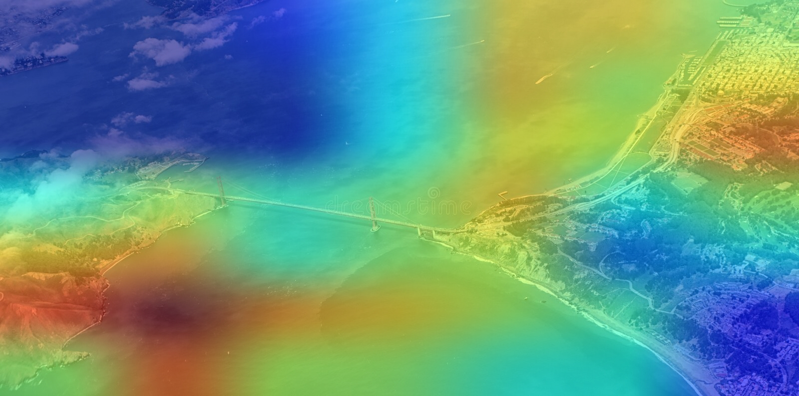

# Landmark classification using Neural Networks
This repository is a part of the project for the course Computer Vision at the University of Zaragoza. The goal of the project is to classify landmarks using Neural Networks. Such landmarks are:
- Brooklyn Bridge
- Eiffel Tower
- Golden Gate Bridge
- Great Wall of China
- The Sagrada Familia
- Tokyo Tower

On the following introduction I will explain how the network was trained and how to use it to classify landmarks.

## The method 📝
When it comes to training a network to classify images, the first thing that comes to mind is to use a Convolutional Neural Network (CNN). However, since it's really expensive to train one from scratch, we will use a method known as **Transfer Learning**.

This method consists on using a pretrained network such as Xception or Mobilenet (more can be found at [Keras Applications](https://keras.io/api/applications/)) and then train a new classifier on top of it. This way, we can use the pretrained network to extract features from the images and then use those features to train a new classifier.

Finally, we will use **Fine Tuning** to achieve the best results. This consists on unfreezing some of the layers of the pretrained network and train them along with the new classifier. This way, the network will be able to learn more specific features from the images.

## The data 🗃️
The dataset used was collected using ohyicong's [Google-Image-Scraper](https://github.com/ohyicong/Google-Image-Scraper) and was cleaned via a manual process to remove irrelevant, misslabeled and poor quality images.

The dataset was divided in 6 classes, one for each landmark. Each class contains around 750 images (except for the Sagrada Familia, which has around 1200 due to it's inconsistency and to the fact that many pictures were taken from the inside of the cathedral). The dataset was divided in 2 sets: train (80%) and validation (20%), while the test set was given by the professor.

It's worth noting that the dataset doesn't have to be this big and could be reduced if needed.

### Data augmentation 📸
Data augmentation is a method used to artificially increase the size of the dataset by applying transformations to the images. This way, the network will be able to learn more general features from the images and will be less prone to overfitting. This method is especially useful when the dataset is small, although it can be used in any case and will improve the results and generalization of the network.

## The model 🔧
For this project two models were used: Xception and MobileNetV2. Both models were pretrained on the ImageNet dataset.

Additional layers were added so the model could learn better to interpret the features extracted the pretrained network. The final model is composed of the pretrained network, a Global Average Pooling layer, a Dense layer with 1024 neurons, a Dropout layer with a rate of 0.5, a Dense layer with 512 neurons, another Dropout layer with the same rate and finally a Dense layer with 6 neurons and a softmax activation function.

## The training process 🏋️
The training process was done in two steps:
1. Train the new classifier on top of the pretrained network.
2. Unfreeze some of the layers of the pretrained network and train them along with the new classifier.

In both cases early stopping was used in order to obtain the best weights possible for the network. The patience was set to 5 epochs and the validation loss was used as the metric to monitor.

## The results 📊
The results obtained were the following:
- 97.81% accuracy using Xception.
- 96.12% accuracy using MobileNetV2.

It's worth noting though that the results may vary depending on the dataset used and the parameters of the training process, but they should be around the same values.

## Some considerations 🤓
Even though the model is able to classify landmarks with a high accuracy, it's worth noting that it's not perfect and it may fail to classify some images. This is due to the fact that certain landmarks are very similar to each other and it's hard to distinguish them even for humans. For example, the Tokyo Tower and the Eiffel Tower are very similar and the model may fail to classify them correctly. In addition, some features that often appear on some landmarks can appear on other images, which may lead to a wrong classification. Some examples are:
- Vegetation: the model has learned to relate vegetation and forests with the Great Wall of China, so it may classify images that include vegetation as the Great Wall of China.

- Selfies: some types of selfies are common in the some concrete landmarks, so the model can classify, for example, a look-down selfie as the Eiffel Tower.

- Aerial views: some landmarks are often seen from the air, so the model may classify an aerial view as some concrete landmark such as the Great Wall of China.
